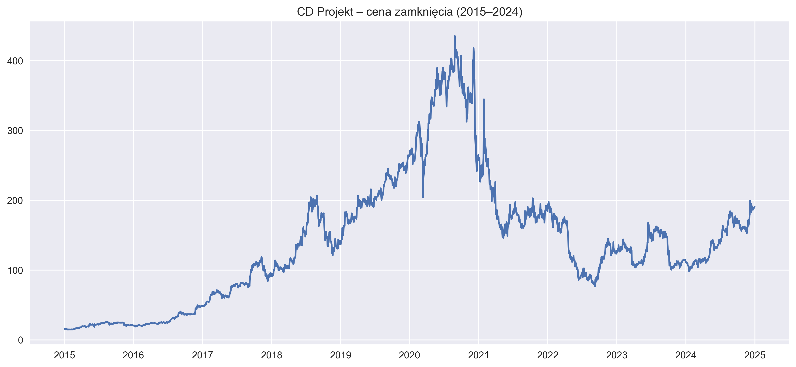
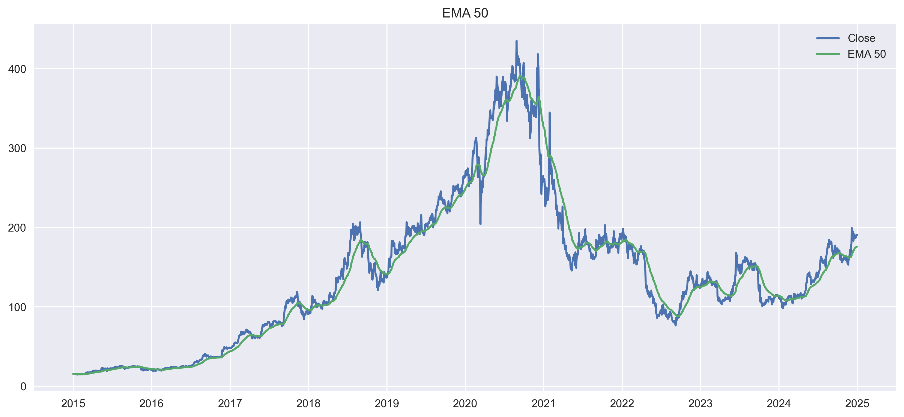

# CD Projekt – Stock Forecast (2015–2024)

A data analysis project focused on forecasting the stock price of CD Projekt using historical data from 2015–2024.  
The workflow includes data preparation, ARIMA modeling, forecasting, technical indicators, and a final analytical summary.

---

## Scope of Analysis

- data collection and preprocessing  
- trend and seasonality analysis  
- ARIMA(5,1,2) time‑series model  
- forecast on test data and 180‑day future forecast  
- technical indicators: SMA, EMA, RSI, MACD  
- saving all charts and forecast outputs  

## Sample Results

  

---

## Technologies Used

- Python (pandas, numpy)  
- statsmodels (ARIMA)  
- scikit‑learn  
- matplotlib  
- Jupyter Notebook  

---

## Output Files

- `arima_test_forecast.csv` — forecast on test dataset  
- `arima_future_180dni.csv` — 180‑day future forecast  

---
